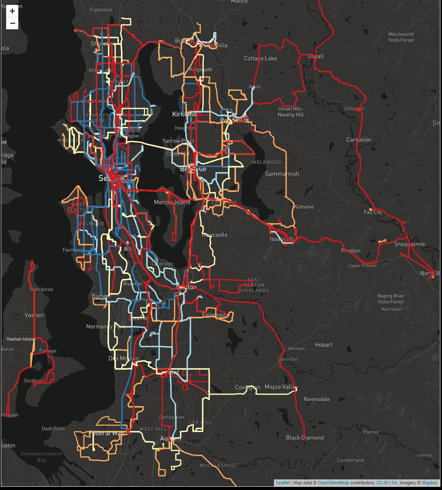
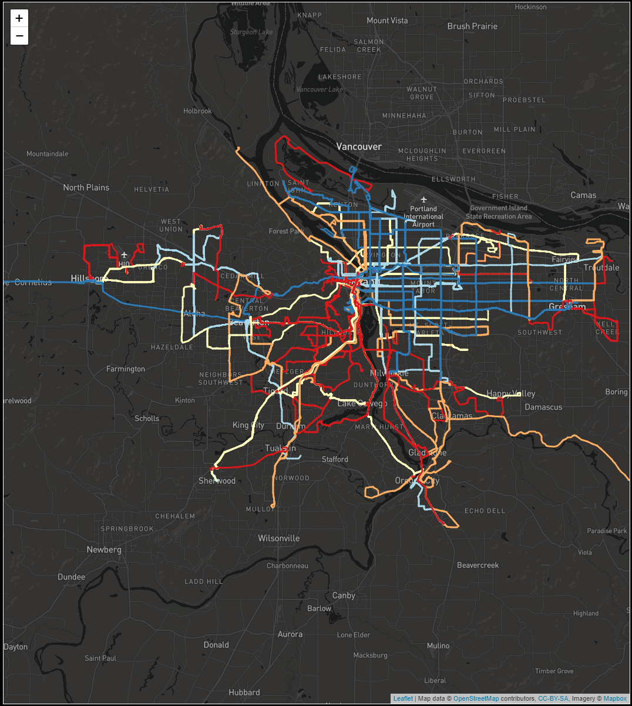

# Welcome to the ROVE Project

## What is ROVE?

ROVE is an interactive bus transit performance analysis tool developed by the MIT JTL-Transit Lab.

ROVE is intended to be a flexible and user-friendly dashboard to visualize and compare the performance of a bus network over time. It is generalizable so that it can be easily adapted to different networks. It includes performance metrics related to scheduled supply, actual supply and passenger loading, based on the data available from the agency. It can be used for service planning, scheduling, detour planning and many other applications. It is browser-based, and therefore does not require any special software or advanced technical knowledge on the part of the end user.

The full documentation of ROVE can be found [here.](https://rove.readthedocs.io/en/latest/index.html)

## Examples
With ROVE, you can easily visualize the converage and service metrics of any bus network. All you need to provide is a standard GTFS file, and ROVE will take care of generating the route shapes, calculating performance metrics, and displaying the infomation on an interactive map in the browser.

Below are a few examples of bus network visualizations generated by ROVE.

<!--  
 -->

King County Metro                        |  Trimet
:---------------------------------------:|:-------------------------------------------:
  |  

## Quick Start