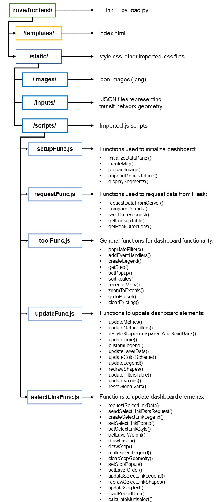

## ROVE Front End File Layout

This folder contains the .html, .js and .css files that define the web application appearance and functionality. 
The files and functions are organized as follows:

- **__init__.py, load.py** contain the Flask functions that send data to the front end.
- **templates/index.html** is the main .html file that defines the static elements of the ROVE dashboard, including the panels, buttons and web map. 
- **static/style.css** is the main .css file that defines the element styling. The other .css files define styling for some of the imported Javascript libraries.
- **static/images/** contains the icons used in the dashboard
- **static/inputs/** contains the .JSON files that define the transit network shapes for each agency
- **static/scripts** contains each of the Javascript files that define the functionality of the dashboard. There are five custom .js files, as well as a handful of imported libraries for specific functions. Each of the custom files has a header listing the functions contained within.
  - setupFunc.js: This file contains several of the key functions used to initialize the dashboard.
  - requestFunc.js: This file contains the functions used to request new data and files from the Flask backend.
  - toolFunc.js: This file contains general functions used to create interactive features. 
  - updateFunc.js: This file contains functions that are used to update dashboard elements based on user input. 
  - selectLinkFunc.js: This file contains functions that are specific to the select link (or "journey visualization") mode of the dashboard.

  
